# 东湖短网址系统

基于 Cloudflare Workers 和 Vercel

**立即尝试**： https://cf-url-admin.li2niu.com/

- 用户名：li2niu
- 密码：li2niu

请不要多次点击删除数据。我们相信您不会的。

## 短网址示例：

https://u.li2niu.com/468
https://u.li2niu.com/tcK
https://u.li2niu.com/666 (用于 404)

## 截图

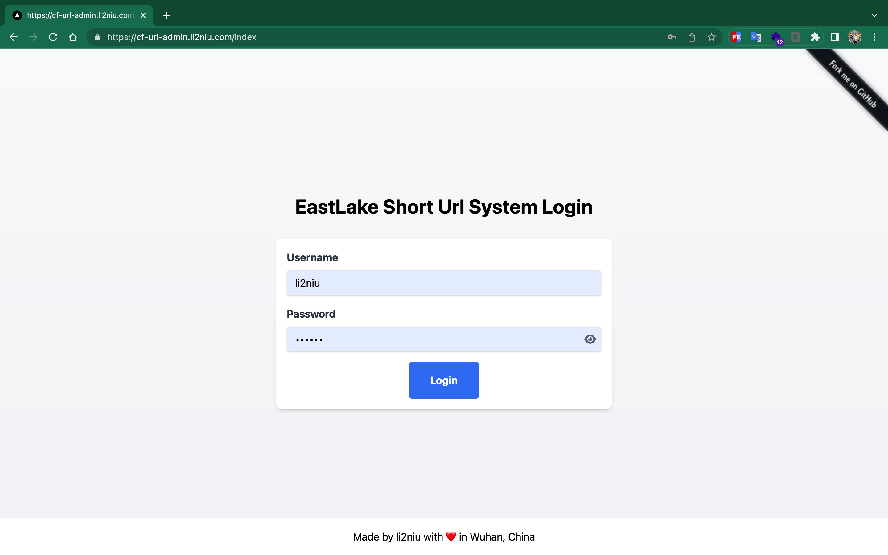
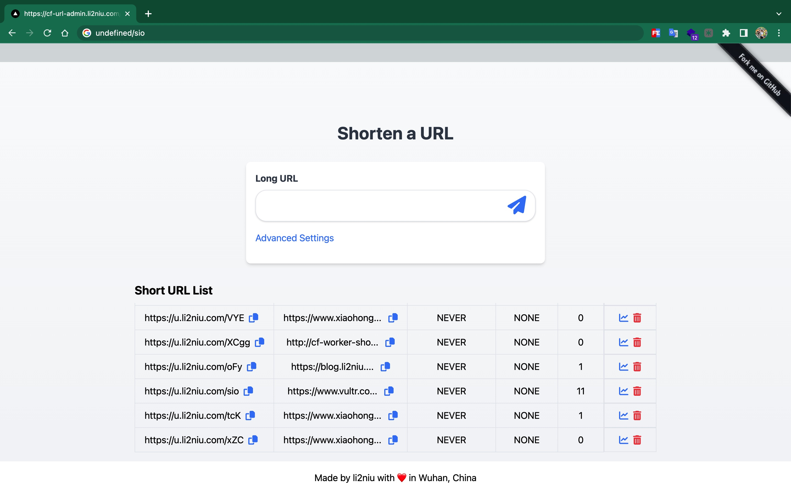
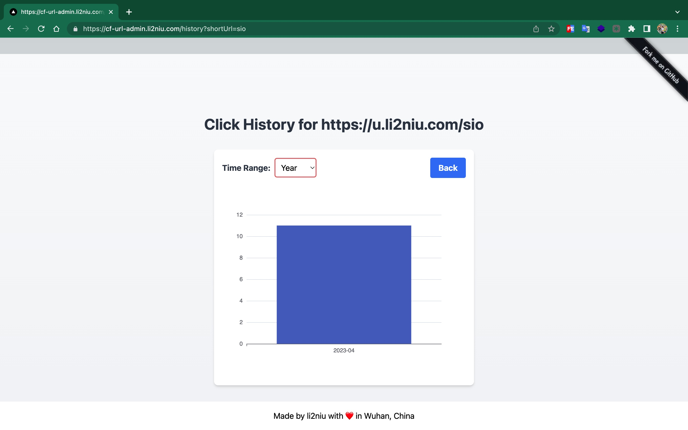
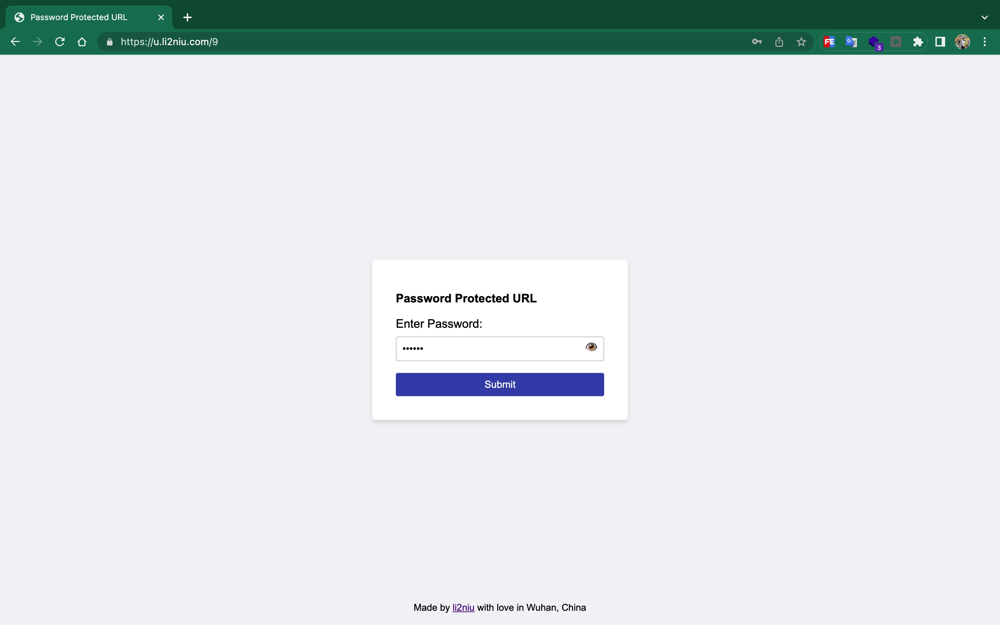
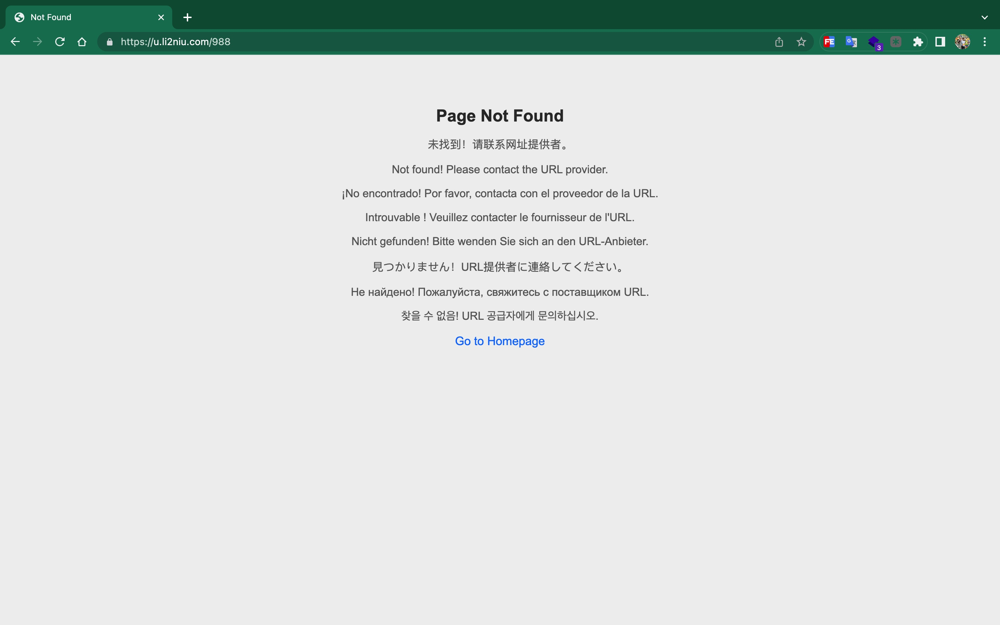

## 功能

### 前端管理 (部署在 Vercel 上的 Next.js 项目，源代码位于 /fe)

- [x] 登录页面：获取凭证以继续。
- [x] 缩短页面：创建短网址。
- [x] 列表页面：在表格中显示短网址。
- [x] 历史页面：查看特定短网址的点击历史。

### 后端服务器 (Cloudflare Worker，源代码位于根目录)

- [x] 准确且迅速地将短网址重定向到其原始的长网址。
- [x] 每个链接监控点击历史（可选；请注意，如果启用，它将消耗大量 Cloudflare KV 的读/写次数。如果您使用的是付费计划，那么由于读/写次数无限制，可以忽略这个问题。但请记住，KV 更多地设计用于读而不是写，所以可能存在不一致性）。
- [x] 支持过期时间。
- [x] 支持密码保护。
- [x] 404 未找到回退页面。

## 前置条件

您必须拥有：

- 一个 Vercel 账户。
- 一个 Cloudflare 账户。
- 一个域名（越短越好）。如果域名由 Cloudflare 管理，后续操作将更加容易。

## 部署

Fork 此仓库并将其克隆到您的本地计算机。然后开始部署过程。

### 前端管理

前端代码位于 /fe，它是一个 Next.js 项目。强烈推荐使用 Vercel。

[](https://vercel.com/new/clone?repository-url=https%3A%2F%2Fgithub.com%2FLikenttt%2Fcloudflare-worker-short-url&env=CLOUDFLARE_WORKER_BASE_URL&envDescription=The%20base%20url%20you%20want%20to%20use%20for%20your%20short%20url.%20&project-name=cloudflare-worker-short-url&repository-name=cloudflare-worker-short-url&demo-title=li2niu-cloudflare-worker-short-url&demo-url=https%3A%2F%2Fcf-url-admin.li2niu.com)

如需使用 google analytics, 请记得在前端部署时添加环境变量 **NEXT_PUBLIC_GA_MEASUREMENT_ID=< your ga4 key e.g G-xxxxxxxxxx>**

```
NEXT_PUBLIC_GA_MEASUREMENT_ID=G-xxxxxxxxxx
```

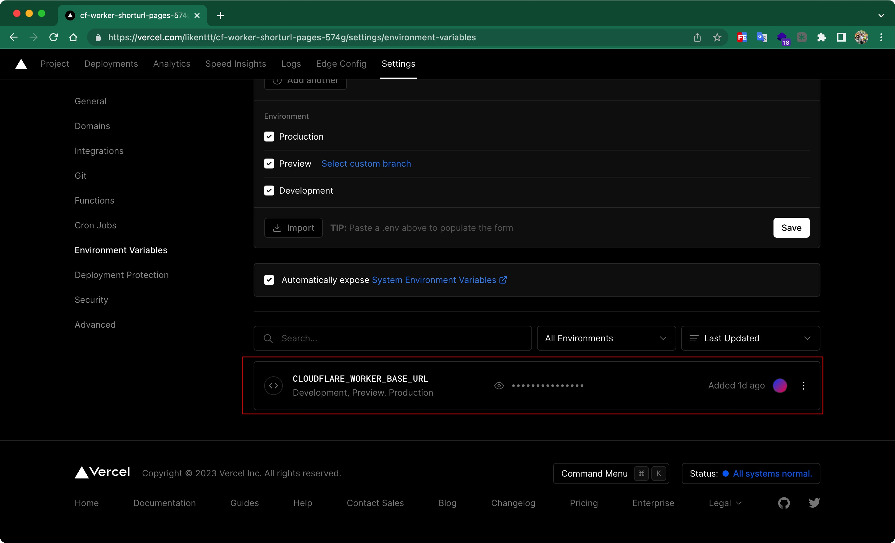
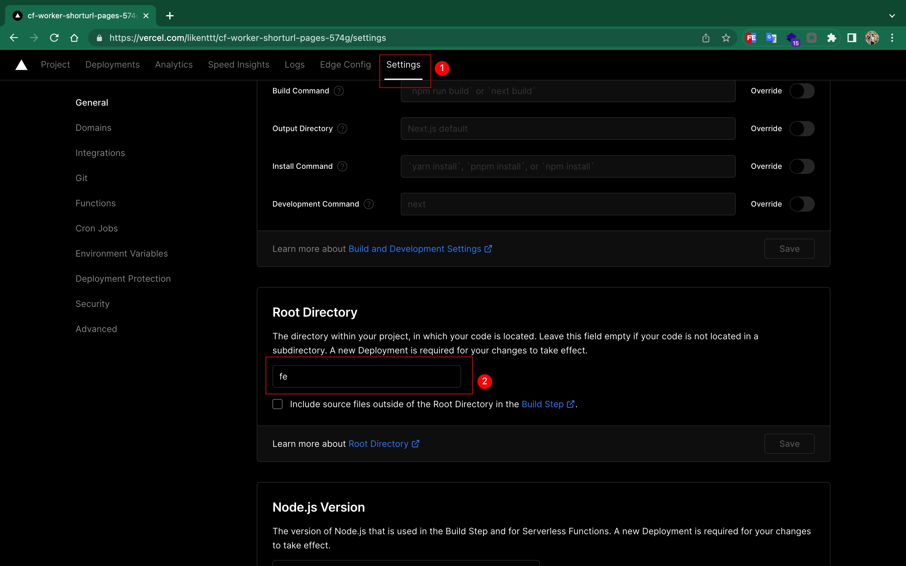
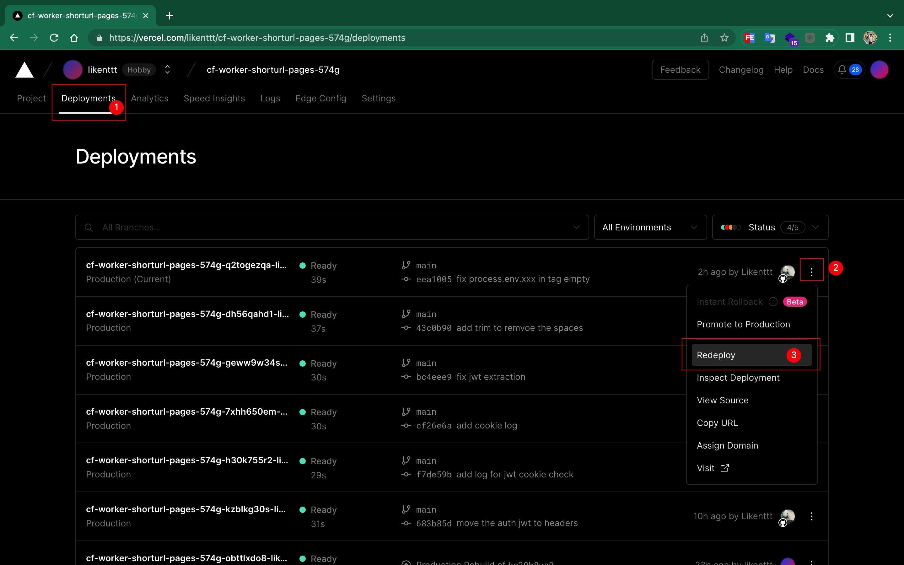

### 后端服务器

#### 初始化 Cloudflare KV 命名空间

在下面的 `wrangler.toml` 中填写 KV 命名空间 ID。将命名空间命名为 `LINKS` 并非必要，因为它只是暴露给 worker 的一个全局变量。

```
[[kv_namespaces]]
binding = "LINKS"
id = "7f0bf9809c464f51871b753cdda2c124" ## 需要将这个id换成你自己的
```

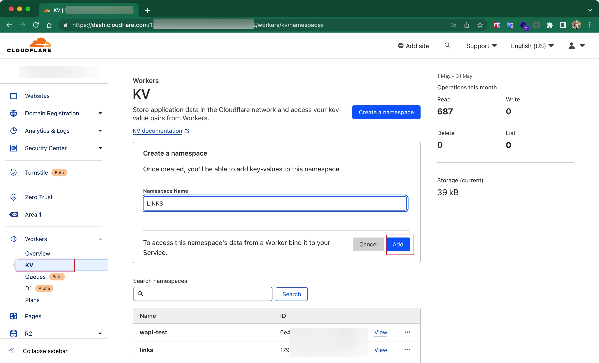
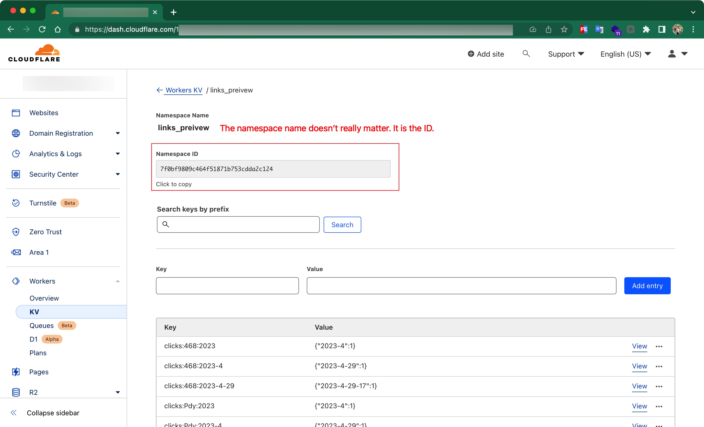

#### 创建一个 worker 服务

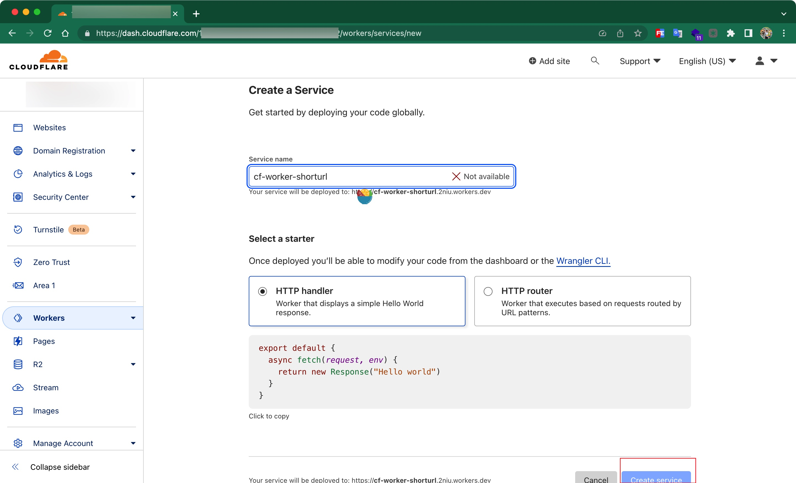

#### 添加环境变量

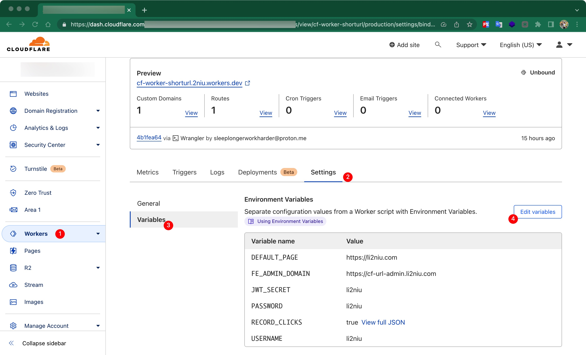
切记不要在你的代码 `wrangler.toml` 中暴露你的环境变量

```
USERNAME = "li2niu" # Change it and don't expose it in this file
PASSWORD = "li2niu" # Change it and don't expose it in this file
JWT_SECRET = "li2niu" # Change it and don't expose it in this file
DEFAULT_PAGE = "https://blog.li2niu.com" # Change it
RECORD_CLICKS = true
FE_ADMIN_DOMAIN = "https://cf-url-admin.li2niu.com" # Replace it with your admin domain, important for cross-origin allowlist

```

#### 将代码 clone 到本地

```
git clone yourrepo
```

#### 本地安装 Wrangler 命令行并登录 Cloudflare

```
npm install -g wrangler
wrangler login
```

#### 部署

```
wrangler publish
```

此后你就可以在前端管理页面创建你的短链接了

### 注意

#### 安全性

为了安全，请使用长且难以猜测的用户名、密码和 JWT 密钥。

#### Cloudflare 免费套餐限制

Cloudflare 免费套餐对 KV 有[限制](https://developers.cloudflare.com/workers/platform/limits/#kv-limits)，尤其是写入次数。即使在付费套餐中，相同键的写入速度也被限制为每秒 1 次，这可能会在高并发下导致不准确。不建议**免费套餐**用户使用点击历史记录功能。

#### Vercel 限制

Vercel 对免费用户有限制，但不太可能被轻易耗尽。

### 支持项目

<a href="https://www.buymeacoffee.com/lichuanyi" target="_blank"></a>

### 鸣谢

- Vercel
- GPT-4
- Cloudflare
